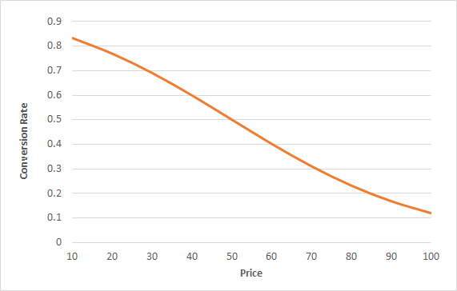
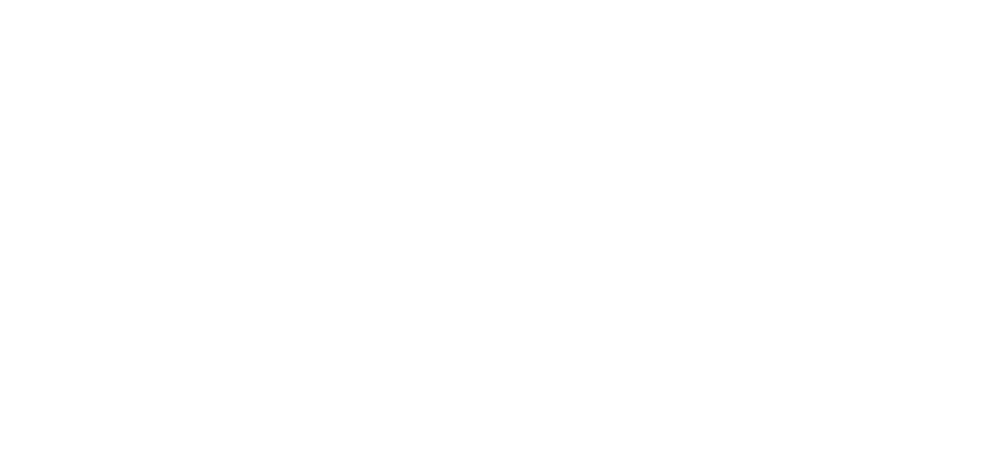
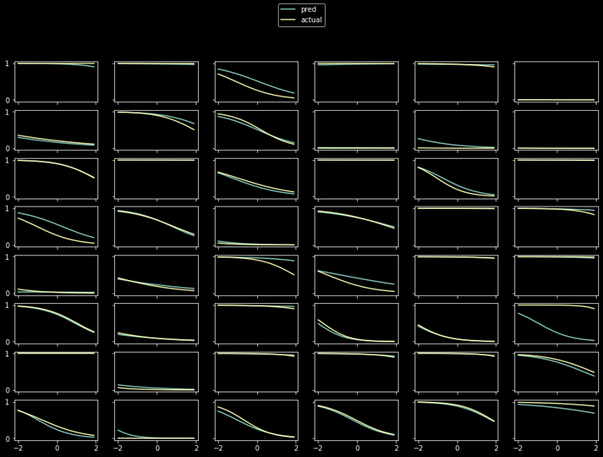
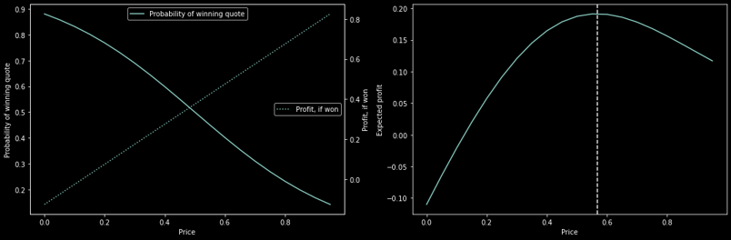
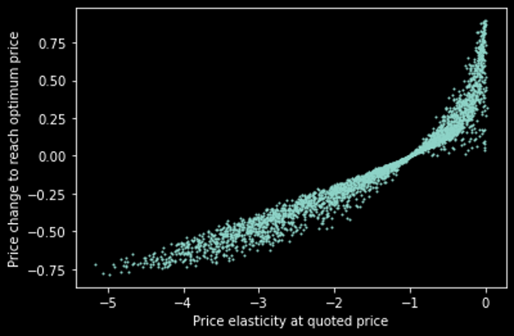
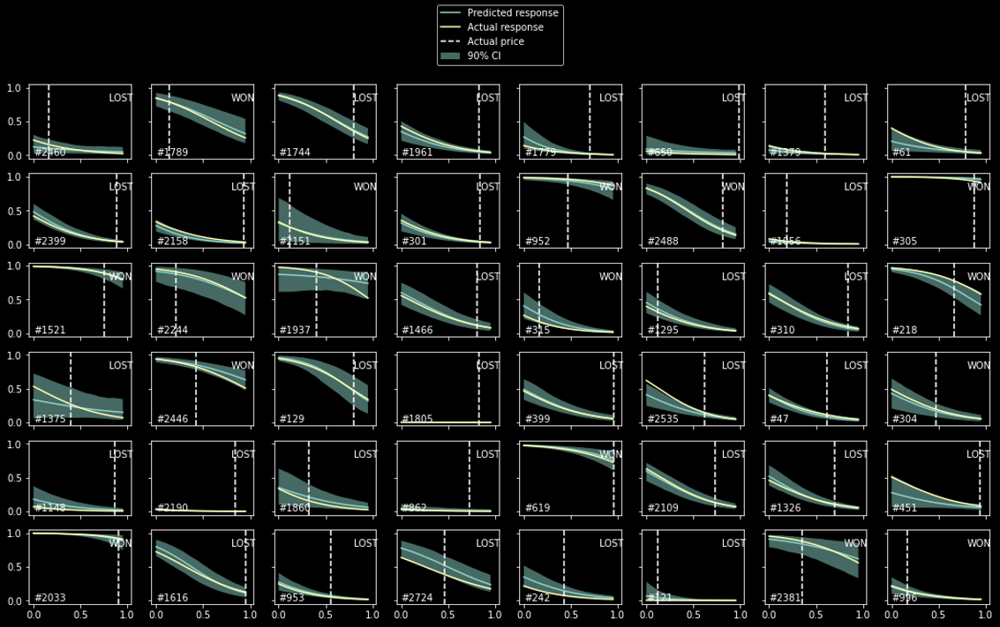
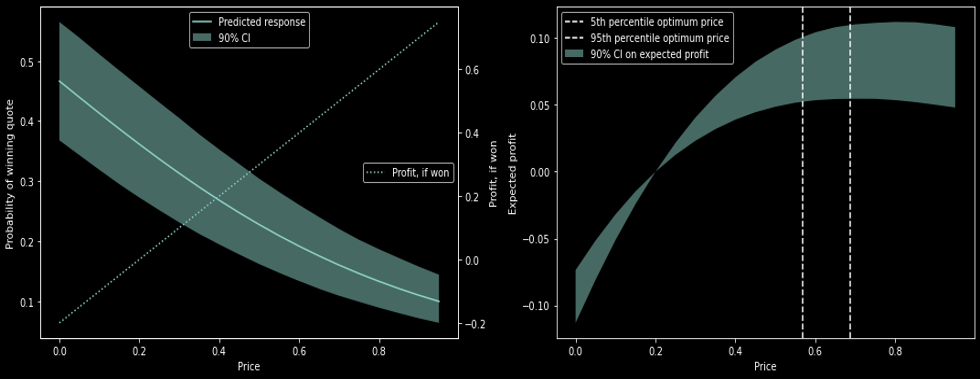

# Interpretable bid-response model using simple neural network

## Background

In pricing analytics, measuring price sensitivity is a common and useful task.  Information on the level of price sensitivity and how this varies by product, customer, channel, time, etc. can be combined with information of how price affects profitability in order to set optimised prices.

Traditionally, econometric models are constructed to predict a volume-related metric such as volume, conversion or market share as a function of explanatory variables including price-like variables such as price, discount and promotions.  In these models the estimated coefficients of the price-like variables can be interpreted as price sensitivities.  In many cases such models are used in price optimisations system.  These typically require that the volume-like metric is expressed as a smooth function of the price-like variables, which is true of the linear and logistic (and other) regression models often used.

A common sales process involves customers requesting quotes for a product or service, receiving a quoted price and either buying or not buying based on that quoted price.  We define the conversion rate to be the proportion of requested quotes in which the customer decides to buy the product or service. Everything else being equal, it is expected that conversion rate decreases as quoted price increases:

This curve is called the bid-response curve and is traditionally modelled using a logistic regression:

where *x* includes price-like variables and others potentially representing customer, product\service, channel, competition, market and other variables.  However this econometric model would typically require considerable hand-crafting and domain expertise to obtain good performance.  On the other hand, there are many machine learning techniques that are appropriate to modelling conversion but these do not naturally output price sensitivity information.

## Purpose

The purpose of this is to demonstrate the application of a simple neural network to the problem of measuring useful price sensitivity in a quotation sales process (as described above).  The benefits of this approach are:

1. Modelling of non-linear effects without hand-crafting interactions and transformed features based on domain expertise.
2. Calculation of price sensitivity for each observation, with the same ease-of-interpretation as in a logistic regression model. 
3. Creation of a smooth bid-response curve for each observation, appropriate for incorporation into a price optimisation.

Benefit (1) is the natural result of using a neural network.   Benefits (2) and (3) arise from the specific design of the final layer of the network.

## Approach

As with a traditional econometric approach to this problem, the idea is to train a model to predict conversion based on the attributes of the quote, including the quoted price.  A simple multi-layer perceptron (MLP) is used with some specific features:

1. The quoted price is not an input to the MLP
2. The MLP has two outputs
3. The final activation is a customised sigmoid function.  This is designed so that the two MLP outputs, &alpha; and &beta;, can be interpreted as the the level and slope parameter of the bid-response curve for that observation.

## Results

This approach has been tested using dummy data.  The data generation process is parameterised so that the main and interaction effects of the attributes on the conversion rate are known.  Three models are trained and then tested on a sample of the dummy data that was not used in training.

| #    | Model description                                            | Example testing loss (per observation) |
| ---- | ------------------------------------------------------------ | -------------------------------------- |
| 1    | Neural network model, as described above                     | 0.29                                   |
| 2    | "Complete" logistic regression model which is structured to match the equation used to generate the dummy data and which therefore correctly recovers the parameter values used in that equation.  This model represents the best possible performance. | 0.26                                   |
| 3    | "Naïve" logistic regression model which considers only the main effect of each attribute and of price.  This model represents a reasonable worst case for performance. | 0.49                                   |

These results vary depending on the number of attributes, the strength of price effects and the strength of interaction effects.  However the overall finding is that the neural network model performs nearly as well as the "complete" logistic regression model, and that is often a lot better than the naïve logistic regression model.  For a bit of fun we can define the following performance metric for the neural network, in comparison to the best and (reasonable) worst cases:

This is 86% using the example losses in the table. 

## Interpretability

Given the formulation of the final activation function, the bid-response curves are smooth and can be used for price optimisation.  Here are the actual and estimated bid-response curves for a random selection of observations.

These bid response curves can be combined with an incremental profit model to determine the optimum price to quote:

Applying that calculation of a large number of quotes reveals sensible patterns, such as the positive association between the price elasticity at the quoted price and the change to the quoted price required to reach the optimum price:

## Uncertainty in bid-response and optimum prices

It is often important to understand the confidence in a recommended price.  The MLP mentioned above has been adapted to a Bayesian MLP in which we aim to learn the distributions of the weights and biases, rather than their 'best' point estimates.  Samples drawn from the trained model are used to assess the uncertainty in the estimated bid-response.  Here are some randomly selected examples in which the shaded region is the 90% confidence interval on the bid-response curve.

More practically for price optimisation, the same sampling process can be applied to the optimum prices.  Here is an example for a single quote where we are 90% confident that the optimum price lies between the two vertical dashed lines.

